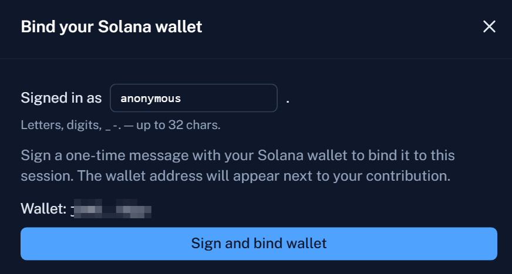

# IX. Trust Setup

[English](#english) | [中文](#中文) | [Русский](#русский) | [日本語](#日本語)

***

## English

A Groth16 proving system is only as honest as the randomness used to set it up. The withdraw circuit at the heart of Voidify — the one that lets a depositor walk away with their SOL without revealing which note they're spending — is verified on-chain against a fixed **verifying key**. Generating that key requires sampling a piece of secret randomness, and **whoever still holds that secret can forge proofs**: they can construct withdrawals that pass on-chain verification against arbitrary nullifiers, minting SOL out of thin air. The job of a trusted setup ceremony is not to ask the world to trust someone with that secret — it is to make sure that **no one** ends up holding all of it.

This chapter describes the public Phase 2 ceremony that produces Voidify's withdraw verifying key, the cryptographic property it relies on, and the artifacts it leaves behind for anyone to audit. Every withdrawal Voidify will ever process is verified on-chain against the keys this ceremony produces. This chapter is how we earn the right to call those keys sound.

### Why a Ceremony

Groth16 splits its setup into two phases. Phase 1 — **Powers of Tau** — is circuit-independent and was performed by the public Perpetual Powers of Tau ceremony with thousands of contributors over multiple years. Voidify reuses one of its publicly archived transcripts; we are not re-running Phase 1.

Phase 2 is **circuit-specific**. Once a circuit (in our case `withdraw.circom`) is compiled to its R1CS form, a fresh round of multi-party computation must mix new randomness with the Phase 1 output to produce the final proving and verifying keys for that exact circuit. This is the round that Voidify is asking the public to participate in.

The security property of Phase 2 is unusual and important: **the resulting verifying key is safe so long as a single contributor was honest and erased their entropy**. Not a majority. Not a quorum. One. Every additional contributor only widens the margin. An attacker who wants to break soundness has to compromise — or be — every single person who ever contributed. By the time this ceremony closes, that target list will not be small.

### How to Contribute

Open the ceremony web app, sign in (GitHub, X, or anonymous), connect a Solana wallet, type a few characters of entropy, and click **Contribute**. Everything cryptographically meaningful happens inside that browser tab. The contributor's secret randomness never leaves the device — it lives only for the duration of one in-browser `snarkjs` call and is gone the moment the tab closes. The published contribution log will then list the wallet address, the optional social handle, and the BLAKE2b-512 hash of the resulting zkey.

### What Anyone Can Check

The ceremony is run by Voidify, but it is not trusted to Voidify. Three properties make the result independently verifiable:

* **Strict chain extension.** The coordinator only accepts a contribution if it extends the existing chain by exactly one new entry, rooted at the same starting state and matching the existing chain entry-for-entry up to that point. Forking from the public genesis and silently overwriting the live chain is not a path the server will follow.
* **Full transcript is public.** The genesis state, the live chain, every archived contribution, and the log mapping each archive to a wallet address and a file hash are all downloadable throughout the ceremony. An auditor can re-walk the chain at any point and confirm that the published final state is the unique result of the published sequence of contributions.
* **Reproducible contribute UI.** The web app is served as a static bundle pinned to IPFS, and a separate verifier repository — [`voidify-ceremony-verifier-frontend`](https://github.com/VoidifyCommunity/voidify-ceremony-verifier-frontend) — builds the same source and emits the IPFS address it would produce. A contributor who reproduces the build for themselves can confirm that the bundle their browser is about to load is exactly the published source — no injected analytics, no hidden upload path that bypasses the local computation.

The first property closes off backend mischief. The second makes any deviation auditable after the fact. The third extends the same audit to the only piece of code with access to the contributor's secret entropy.

If all three hold, the only remaining trust assumption is the one this whole ceremony exists to soften: that **at least one of the contributors honestly discarded their entropy**. That is the entire residual surface.

### Finalization

When the contribution window closes, a **public-beacon randomness layer** is applied on top of the final chain — typically the hash of a future Bitcoin block, fixed and announced in advance, before its value can be known. The beacon closes the one residual attack the per-contributor model does not close on its own: a contributor who chose their entropy after seeing every transcript before theirs still cannot anticipate a value that did not yet exist when they decided to participate.

The verifying key is then extracted and embedded into the on-chain withdraw verifier by a Solana program redeploy. There is no off-chain switch that swaps the keys quietly: any change to the keys the network verifies against is itself a public on-chain event.

### Why This Is Enough

Every additional contributor adds one more person an attacker would have to compromise — and even one honest participant is sufficient to make the verifying key sound. Contributing requires no token, no KYC, no social account, no special hardware. The browser does the work, the server records the result, and the public log makes the record permanent.

**One honest contributor is enough — and every contribution after the first only widens the margin.**

***

## 中文

### 为什么需要仪式

Voidify 提款使用 Groth16 证明，并在链上通过固定 verifying key 进行验证。生成该密钥需要秘密随机数。如果某一方保留了全部随机数，就可能伪造看似有效的证明。多方可信设置仪式的目标是：只要至少一位参与者诚实地操作并删除其熵，最终密钥就保持可靠。

Phase 1 使用公开的 Powers of Tau 记录。Phase 2 专门对应 Voidify 的提款电路，并生成该电路最终使用的 proving key 与 verifying key。

### 参与贡献

在仪式应用中，参与者连接钱包、提供新的熵并提交贡献。关键密码学计算在浏览器中完成，秘密熵无需离开参与者的设备。

<figure><figcaption></figcaption></figure>

### 可验证性

该仪式面向公开验证设计：

* 每一份贡献都必须延续上一份 transcript。
* Transcript 与贡献记录可以公开，以供独立审计。
* 前端可进行可复现构建并固定在 IPFS 上。
* 贡献结束后，可在提取最终 verifying key 前加入公共 beacon 随机层。

最终密钥的安全性依赖于仪式的核心假设：至少有一位参与者诚实地删除了自己的秘密熵。

***

## Русский

### Зачем нужна церемония

Выводы Voidify используют доказательства Groth16, проверяемые ончейн по фиксированному verifying key. Для создания этого ключа требуется секретная случайность. Если одна сторона сохранит всю эту случайность, она сможет подделывать доказательства, выглядящие действительными. Многосторонняя церемония настройки устроена так, чтобы ключи оставались надежными, если хотя бы один участник действовал честно и удалил свою энтропию.

Phase 1 использует публичный транскрипт Powers of Tau. Phase 2 относится именно к схеме вывода Voidify и создает окончательные proving key и verifying key для этой схемы.

### Участие

В приложении церемонии участник подключает кошелек, предоставляет новую энтропию и отправляет вклад. Криптографическое вычисление происходит в браузере, а секретная энтропия не должна покидать устройство участника.

<figure><figcaption></figcaption></figure>

### Проверяемость

Церемония проектируется для публичной проверки:

* Каждый вклад должен продолжать предыдущий транскрипт.
* Транскрипт и записи вкладов могут публиковаться для независимого аудита.
* Фронтенд может воспроизводимо собираться и закрепляться в IPFS.
* После завершения вкладов перед извлечением окончательного verifying key может быть добавлен публичный beacon-слой случайности.

Полученный ключ безопасен при центральном допущении церемонии: хотя бы один участник честно удалил свою секретную энтропию.

***

## 日本語

### なぜセレモニーが必要か

Voidify の出金は、固定された verifying key に対してオンチェーンで検証される Groth16 証明を使用します。このキーの生成には秘密の乱数が必要です。一者がすべての乱数を保持していれば、有効に見える証明を偽造できる可能性があります。マルチパーティのセットアップセレモニーは、少なくとも一人の参加者が誠実に行動し、自身のエントロピーを削除すれば、キーの健全性が保たれるよう設計されています。

Phase 1 は公開された Powers of Tau transcript を使用します。Phase 2 は Voidify の出金回路に固有であり、その回路用の最終 proving key と verifying key を生成します。

### 貢献方法

セレモニーアプリケーションで、参加者はウォレットを接続し、新しいエントロピーを提供して貢献を送信します。暗号学的計算はブラウザ内で行われ、秘密のエントロピーを参加者のデバイス外へ送る必要はありません。

<figure><figcaption></figcaption></figure>

### 検証可能性

セレモニーは公開検証を可能にするよう設計されています。

* 各貢献は前の transcript を延長する必要があります。
* Transcript と貢献記録は独立監査のために公開できます。
* フロントエンドは再現可能にビルドし、IPFS に固定できます。
* 貢献終了後、最終 verifying key の抽出前に公開 beacon の乱数層を追加できます。

生成されたキーの安全性は、少なくとも一人の参加者が秘密のエントロピーを誠実に破棄したというセレモニーの中心的な仮定に基づきます。
